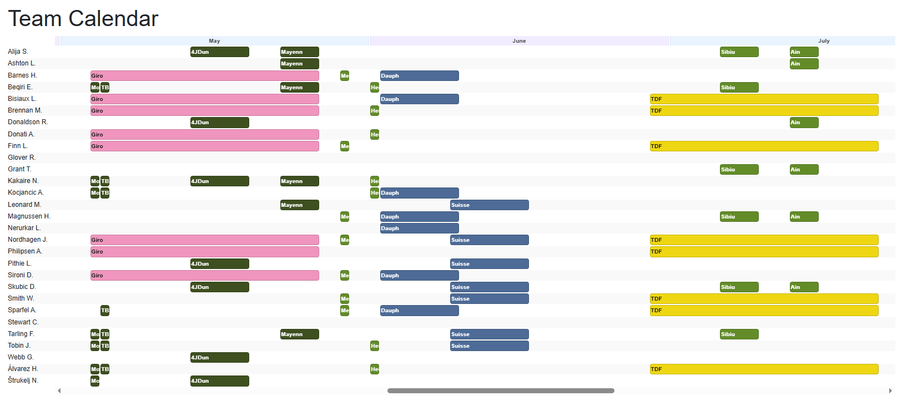

# PCM Season Planner

A companion planning tool for **Pro Cycling Manager 2024** season scheduling. It reads your career save via [Lachis Editor](https://github.com/LachisSpaces/LachisEditor), imports your team's riders and race calendar, runs an optimiser to assign riders to races, and displays the result as an interactive web calendar.

The goal is to produce better race assignments than PCM's built-in scheduler.



---

## Prerequisites

| Requirement | Notes |
|---|---|
| Python 3.10+ | For the migration and optimiser |
| .NET 9 SDK | For the web app |
| [Lachis Editor](https://github.com/LachisSpaces/LachisEditor) | To export your PCM career save |
| PCM 2024 Tool (`CTStageEditor.exe`) | Included with the PCM 2024 Tool install |
| PCM base-game `CM_Stages` folder | Part of your PCM installation |
| Mod/workshop `Stages` folder | Only needed if you use mods |

---

## Getting started

### 1. Configure the batch scripts

Edit `scripts/migrate.bat` and `scripts/optimise.bat` to point at your local paths. The key arguments in `migrate.bat` that you will need to update are:

```bat
--lachis-export C:\path\to\LachisEditor\Data\Career_1
--base-stages C:\path\to\PCM2024\CM_Stages
--mod-stages C:\path\to\workshop\Stages
--stage-editor-exe C:\path\to\PCM2024 Tool\CTStageEditor.exe
```

### 2. Configure squad compositions

Open `optimise/squad_config.py` and verify that every `(profile, squad_size)` combination present in your calendar has a matching entry. Each entry defines how many riders fill each role for that race type.

For example, a 7-rider sprint race entry looks like:

```python
(SquadProfile.SPRINT, 7): {
    RiderRole.SPRINT_LEAD:    1,
    RiderRole.SPRINT_LEADOUT: 2,
    RiderRole.DOMESTIQUE:     3,
    RiderRole.FREE:           1,
},
```

The valid profiles are `SPRINT`, `CLIMBING`, `TIME_TRIAL`, and `STAGE_RACE`. If a combination is missing the optimiser will report it during its pre-solve checks.

### 3. Run the migration

Export your PCM career from Lachis Editor, then run:

```bat
scripts\migrate.bat
```

This reads your Lachis export, resolves stage files, invokes `CTStageEditor.exe` to export per-stage metadata, and writes everything to `data/planner.sqlite`. Stage exports are cached — subsequent runs are fast.

### 4. Run the optimiser

```bat
scripts\optimise.bat
```

The solver assigns each rider to a role in each race, maximising total terrain-and-role suitability. Results are written back to the database. By default the time limit is 30 seconds, but you can modify this value in the `optimise.bat` script.

### 5. View the plan

```bat
cd pcm-planner
dotnet run
```

Open `http://localhost:5000` in your browser. The home page shows the full-team season calendar. Click any rider or race for details.

---

## The web app

The Blazor Server app at `http://localhost:5000` visualises the latest optimisation result.

**Home** — A scrollable full-team season calendar (one row per rider, day-accurate race blocks, colour-coded by race class) followed by a chronological race list.

**Race detail** — Squad profile, assigned riders with their roles, and (for stage races) a stage list showing terrain and type.

**Rider detail** — Age, full stat table, a per-rider month-by-month calendar, a role-breakdown summary, and the rider's full race list.

The sidebar lists all roster riders with their total assigned race days. The header shows season-level stats (race count, rider count, average race days per rider).

Race blocks are colour-coded using their PCM colour, e.g. Grand Tours get their brand colours (yellow/pink/orange) Hovering a block shows a tooltip with the race name, dates, and stage count.

---

## How the optimiser works

Each race is automatically classified into a **squad profile** based on its stage terrain:

| Profile | Assigned when |
|---|---|
| `time_trial` | The race is a single time trial or team time trial |
| `sprint` | Single-day classic, Flat or Hilly terrain |
| `climbing` | Single-day classic, Mountain terrain |
| `stage_race` | Any multi-stage race |

The profile and squad size determine the role breakdown (from `squad_config.py`). The solver then scores every rider–race–role triple by combining a terrain suitability score (matching rider stats to stage profiles) with a role fitness score (e.g. a `sprint_lead` role rewards Sprint and Acceleration). It maximises total score subject to these hard constraints:

- Each role slot in every race is filled the correct number of times.
- No rider fills more than one role in any given race.
- No rider is assigned to overlapping races.
- No rider is assigned more than 100 race days.
- For national championship races, only riders whose nationality matches the host country may be assigned, and all eligible riders in the squad must be sent (up to squad capacity).

And score is penalized for falling outside the 60- to 70-day target workload. The workload ranges and penalties, and the absolute maximum number of race days allowed, are configured in `RaceDayPenalties` in `model.py`.

---

## Technical reference

### `migrate` package

Populates the planner database from a Lachis Editor XML export. Reads team, rider, race, and stage data; resolves `.cds`/`.cdx` stage files; invokes `CTStageEditor.exe` for per-stage metadata; caches results.

**CLI:**
```
--target PATH             Output SQLite database path.
--reset                   Drop and recreate all tables.
--lachis-export PATH      Lachis Editor XML export folder.
--import-races-and-stages Import races, stages, and Stage Editor metadata.
--mod-stages PATH         Mod/workshop Stages folder (takes priority over base game).
--base-stages PATH        Base-game CM_Stages folder.
--stage-editor-exe PATH   Path to CTStageEditor.exe.
--force-stage-export      Re-export all stage metadata (only needed if .cds files changed).
```

The player team and in-game date are detected automatically from the export.

**Modules:** `schema.py` (DDL), `parsing.py` (XML helpers), `teams.py`, `riders.py`, `races.py`, `stage_files.py` (CDS/CDX resolution and Stage Editor invocation), `__main__.py` (CLI).

---

### `optimise` package

Loads the planner database, classifies races, builds a scoring matrix, and solves a CP-SAT assignment model via Google OR-Tools.

**CLI:**
```
--database PATH      Path to the planner SQLite database.
--time-limit SECS    Optional solver wall-clock cap. Omit for proven optimality.
```

**Role scoring formulas:**

| Role | Stat formula |
|---|---|
| `domestique` | `flat÷2 + hill÷2` |
| `free` | `baroudeur÷2 + stamina÷2` |
| `sprint_lead` | `sprint×2÷3 + acceleration÷3` |
| `sprint_leadout` | `sprint` |
| `climbing_lead` | `stamina÷2 + mountain÷6 + medium_mountain÷6 + hill÷6` |
| `climbing_domestique` | `mountain÷3 + medium_mountain÷3 + hill÷3` |
| `time_trial` | `time_trial×4÷5 + resistance÷5` |

**Modules:** `model.py` (data classes and enums), `db.py` (load/save), `scoring.py` (terrain and role scoring), `squad_config.py` (composition config), `constraints.py` (pre-solve checks), `solver.py` (CP-SAT model), `__main__.py` (CLI).

---

### `pcm-planner` web app

Blazor Server app. Reads directly from `data/planner.sqlite` via `RosterService`. No separate API layer.

**Key files:** `Data/RosterService.cs` (all DB queries), `Data/CalendarHelpers.cs` (race colouring and tooltips), `Components/Shared/TeamCalendar.razor`, `Components/Shared/RiderCalendar.razor`.

The database path is set in `appsettings.json` under `DatabasePath` (default: `..\data\planner.sqlite`).

---

## What's not yet built

- Writeback to PCM save files
- Manual race assignment overrides
- Season objectives, fitness peaks and recovery time
- Stage race overall optimization; right now it's just scored per stage

